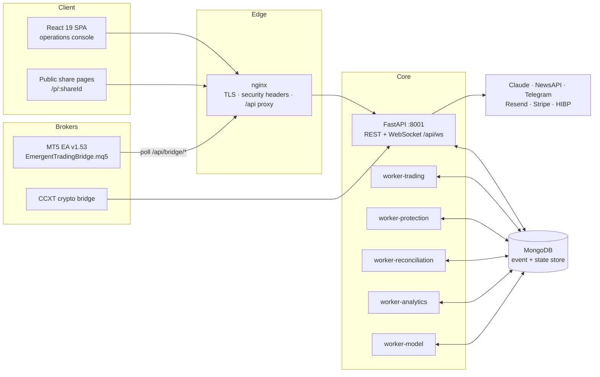
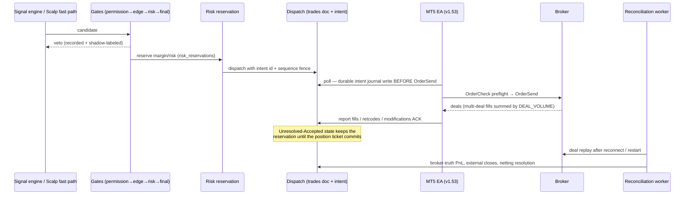
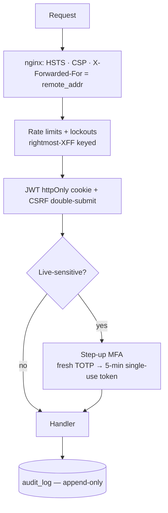

# STOIC — Architecture

Event-driven quantitative trading platform: React operations console, FastAPI
core, MongoDB event/state store, MT5 Expert Advisor bridge and a CCXT crypto
bridge, with dedicated background workers behind leader leases.

## 1 · System context



- The **EA polls outbound** (`/api/bridge/poll-trades`, heartbeats, reports) —
  no inbound connection to the trader's machine is ever required.
- Workers coordinate through **leader leases** (`worker_leases` collection) so
  any number of replicas can run; exactly one owns each loop.
  The API refuses to double-run loops when `BACKGROUND_WORKERS_IN_PROCESS=false`.

## 2 · Order execution flow (single source of truth)



## 3 · Security layers



Plus: TOTP 2FA + recovery codes, HIBP breached-password screening
(k-anonymity, fail-open), per-account `bridge_token` for the EA,
`X-API-Key` scoped enterprise keys, token-gated Prometheus `/api/metrics`,
production startup guard (`APP_ENV=production` forbids test bypass tokens,
requires CORS allowlist).

## 4 · Key MongoDB collections

| Collection | Role |
|---|---|
| `trades` | Order/position lifecycle; broker tickets, lifecycle_state, PnL truth flags |
| `trade_events` | Immutable event stream (OrderIntentCreated, PartialFillAdopted, …) |
| `broker_deals` | Broker-truth deal ledger (profit/commission/swap) — feeds Verified Performance |
| `trade_decisions` / `scalp_decisions` | Engine evaluations, gate verdicts, shadow outcomes |
| `risk_reservations` | Guaranteed risk/margin holds until broker commit |
| `signals` | AI signals with confidence + regime (calibration source) |
| `accounts` | Broker profiles, EA version, heartbeats, symbol specs, certification inputs |
| `bot_configs` | Per-account strategy config, trips, risk levels |
| `audit_log` | Append-only security trail (step-up, activations, panic) |
| `step_up_tokens` / `sessions` / `api_keys` | Auth artifacts (hashed) |
| `worker_leases` / `outbox` | Worker leadership + queued EA commands |
| `performance_shares` | Public verified-performance share links |

## 5 · Repository layout

```
backend/
  server.py            app wiring, middleware, WS endpoint, startup guards
  routes/              ~30 routers (auth, bot, bridge, scalp, accounts, …)
  workers/             trading / protection / reconciliation / analytics / model
  scalp/               fast-path engine, gates, order state, reservations
  static/EmergentTradingBridge.mq5   the MT5 EA (v1.53)
  tests/               2800+ tests (unit + HTTP integration)
frontend/src/
  pages/               route-level screens
  components/          panels, dialogs, shadcn/ui
  lib/api.js           axios + CSRF + silent refresh + step-up interceptor
deploy/                nginx.conf, install.sh, update.sh, backup.sh
docs/                  runbooks, DR, validation campaign, this file
.github/workflows/     ci.yml (tests, EA compile, blocking scans), release.yml (signed releases)
```

## 6 · Design invariants

1. **Broker truth wins** — deal-level resolution (`DEAL_VOLUME` sums) overrides
   any locally assumed state; estimates are flagged, never silently trusted.
2. **Every risk change is fenced** — sequence numbers fence stale EA commands;
   reservations only release on confirmed broker commit.
3. **Stopping is instant, resuming is guarded** — panic never prompts;
   releasing panic / activating live / raising risk requires step-up MFA.
4. **Append-only history** — trade_events and audit_log are never mutated.
5. **All config via environment** — no secrets in code; production refuses
   test bypass tokens at startup.
